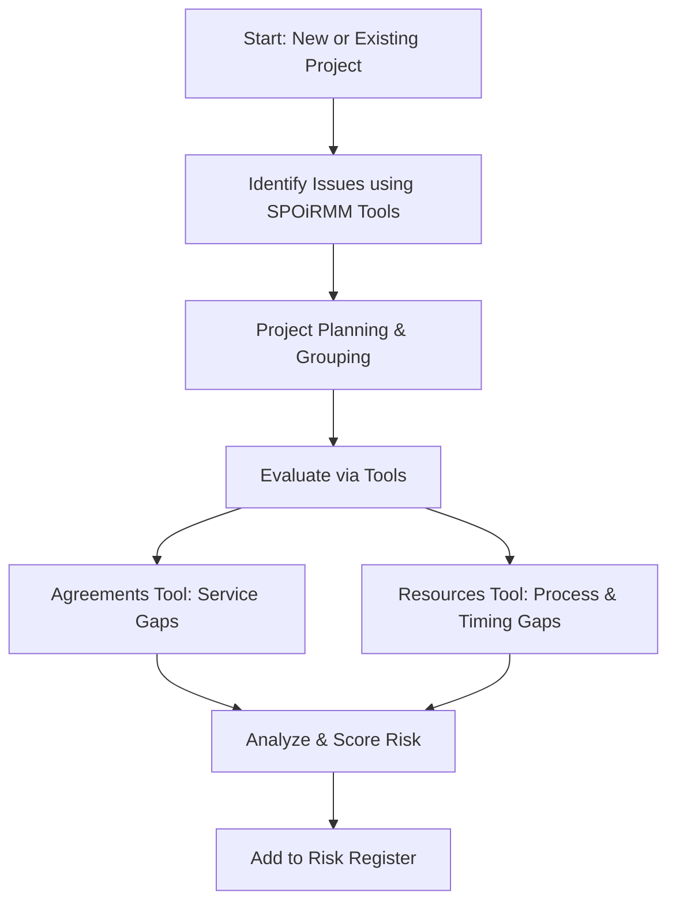

# SPOiRMM Issue-to-Risk Workflow Specification

## Purpose
This document defines how the SPOiRMM Risk Management Application supports the process of identifying issues, planning responses, and formalizing risks for both new and existing projects using the SPOiRMM framework.

---

## Workflow Overview

### Main Process Flow

- **New projects** begin by using the **6 SPOiRMM tools** to structure understanding of players, jurisdictions, markets, agreements, resources, and enterprise setup.
- **Existing projects** use the same tools to identify emerging gaps or breakdowns.
- The **Agreements Tool** helps surface **unmet stakeholder needs** or **missing agreements**.
- The **Resources Tool** identifies **timing gaps, workflow delays, and resourcing risks**.
- Insights from all tools support **project planning**, followed by **formal evaluation** and **risk registration**.

---
## Key Steps

### 1. Jurisdiction Tool (Influencing)
**Purpose:** Examine external regulatory environments and their influence on organizational risk.

**Pre-requisites:**
- Regulatory Bodies must be added to the Players Chart as Regulators or Representatives.
- Jurisdiction Levels (Federal, State, Local) — configured in System-Level Settings.
- Regulatory Categories — configured in System-Level Settings.
- Laws/Standards List — configured in System-Level Settings.
- **Category Mapping**: Players must be tagged with applicable Regulatory Categories.
- **Jurisdiction Level Mapping**: Regulatory Bodies and Laws must be assigned to one or more Jurisdiction Levels.
- Risk and issue tagging with associated jurisdiction(s).
- Optional visibility scoping and change tracking.

**Pre-requisites:**
- Regulatory Bodies must be first added to the **Players Chart** as Regulators or Representatives.
- Jurisdiction Levels (Federal, State, Local) — configured in **System-Level Settings**, see below
- Regulatory Categories — configured in **System-Level Settings**, see below
- Laws/Standards List — configured in **System-Level Settings**, see below
- Regulatory Bodies (e.g., health departments, financial regulators)
- Tool UI Configuration:
  - Multi-jurisdiction selector
  - Boundaries and nested regions structure
  - Ability to associate one entity (law, regulator) with multiple jurisdiction levels
  - Risk and issue tagging with associated jurisdiction(s)
  - Optional visibility scoping (e.g., restrict by jurisdiction per organization)
  - (Optional) Jurisdictional change tracking/versioning for laws and standards

---
---

### 2. Market Tool (Influencing)
**Purpose:** Define and analyze market dynamics, players, and product/service exchanges.

**Pre-requisites:**
- Market Types and Segments — configured in System-Level Settings.
- Product/Service Definitions — linked to Market Types.
- Market Stability Status and Influence Matrix Template.
- Key Market Players — from Players Chart.
- **Market Tags** — configured for filtering and classification.
- **Product ↔ Market Mapping** — assign services/products to markets.
- **Exchange Flow Definitions** — maps between Provider/Recipient/Supplier.
- **Org ↔ Market Participation Map** — defines which Orgs operate in which markets.
- Optional Market KPIs, visual mapping, and heatmaps.

**Pre-requisites:**
- Market Type (e.g., Healthcare, Finance, Manufacturing) — configured in **System-Level Settings**, see below
- Market Segments or Submarkets (e.g., Public Hospitals, Aged Care) — configured in **System-Level Settings**
- Product/Service Definitions — configured in **System-Level Settings**
  - Products/Services should be linked to one or more Market Types or Segments
- Market Stability Status (e.g., Stable, Declining, Expanding) — configured in **System-Level Settings**
- Market Influence Matrix Template — optional, defined in **System-Level Settings**
- Key Market Players List — sourced from the **Players Chart**, which defines each Player’s role, nature, and market participation
  - Roles: Provider, Recipient, Supplier, Benefit Maximizer, Cost Minimizer
  - Optional Player Influence Level (e.g., High, Medium, Low) per market
- Support for organizations and players operating in multiple markets
- Market tagging for risks and issues to classify them by sector or segment
- Optional tracking of Market KPIs (e.g., growth %, demand levels, churn)
- Product Exchange Mapping (who provides what to whom)
- Optional dependency mapping for critical inter-player or service relationships
- Org-to-Market Participation Mapping (define which orgs operate in which market types/segments)
- UI Configuration:
  - Optional visual market mapping tool (size, participants, influence flows)
  - Selectable filters by market type or segment for reporting and planning
  - Optional risk heatmaps and issue density visualizations by market

---
---

### 3. Enterprise Tool (Managing)
**Purpose:** Define and assess external contractual relationships between organizations and stakeholders.

**Pre-requisites:**
- Contract Types and Fields — including Term, Duration, Renewal.
- **Contract Status List** — defines lifecycle stages.
- **Contract Owner** — assignable internal owner (user or department).
- **Obligations Table** — optional tracking of commitments and penalties.
- **Risk Classification** — tier or impact category.
- **Document/Link Attachment** — upload or reference signed contracts.
- Contract Entities — Staff, Suppliers, Recipients from Players Chart.
- Player Role Mapping and optional UI filters.

**Pre-requisites:**
- Contract Types (Supply, Employment, Benefit Delivery) — defined in **System-Level Settings**
- Contract Entities:
  - Staff, Suppliers, Recipients, Benefit/Cost Maximizers — configured via Players Chart
- Contract Fields:
  - Terms, Duration, Initiation/Termination, Frequency
  - Decision-Making, Exchange, Satisfaction criteria
- Player Role Map (organizational view)
- Contractual Risk Indicators (qualitative or numerical)

---
---

### 4. Organisation Tool (Managing)
**Purpose:** Analyze internal departmental functions and how they support enterprise performance.

**Pre-requisites:**
- Department List and Role Assignment (L1–L3).
- **Staff Mapping** — assign people or roles to each department.
- **KPIs or Metrics** — performance measures per department.
- **Objectives** — departmental strategic goals.
- Process Inventory — key internal processes.
- **Classification Tags** — e.g., Clinical, Admin, Operational.
- Optional Cost Centers and Org Chart UI.

**Pre-requisites:**
- Internal Department List — created during organization setup
- Departmental Role Assignment (L1, L2, L3) — configured using the **Internal Functions Worksheet**
- Departmental Cost Centers — defined optionally in **System-Level Settings**
- Process Inventory (functions and KPIs)
- Staff-to-Department Mapping
- Departmental Performance Metrics (optional but helpful)

---
---

### 5. Agreements Tool (Doing)
**Purpose:** Correlate needs and services between Players via formal/informal agreements.

**Pre-requisites:**
- Agreement Types and Needs Categories (L1–L3).
- Services Catalog and **Needs ↔ Services Matrix**.
- Agreement Participants from Players Chart.
- **Validity Periods** — including status (Draft, Active, etc).
- **Gap Flags** — logic to detect unmet needs.
- **Performance Metrics** — fulfillment or delivery rates.
- **Link to Contracts** — reference to Enterprise Tool records.

**Pre-requisites:**
- Agreement Types (SLAs, MOUs, Contracts, Verbal) — defined in **System-Level Settings**
- Needs Categories (L1 Decision, L2 Exchange, L3 Satisfaction) — standardized reference list
- Services Catalog (what is delivered by whom) — maintained centrally
- Agreement Matrix Structure:
  - Needs vs. Services alignment
- Agreement Participants:
  - Suppliers, Staff, Benefit Maximizers, Cost Minimizers, Recipients (via Players Chart)
- Missing Agreement Flags or Gap Triggers

---
---

### 6. Resources Tool (Doing)
**Purpose:** Visualize resource use and timing in support of agreed service delivery.

**Pre-requisites:**
- Workflow Templates and Resource Types.
- SLAs and Performance Timelines.
- Resource Movement Mapping (Supplier → Provider → Recipient).
- **Resource Assignment Matrix** — assigns resources to steps.
- **Availability Calendar** — manage constraints.
- **Utilization Thresholds** — alert on over/underuse.
- **Link to Agreements or Contracts** for resource delivery alignment.

**Pre-requisites:**
- Process Maps or Workflow Templates — configured in **System-Level Settings**
- Process Owners and Steps
- Resource Types (Human, Technical, Financial)
- Time-Based Objectives or SLAs — available in system-wide settings
- Performance Timelines
- Resource Movement Definitions:
  - Between Supplier and Provider
  - Between Provider and Recipient
- Internal Function Alignment (L1, L2, L3 markers)

---

These preconditions ensure each tool is usable, effective, and aligned with the organization's structural and operational realities.

## System-Level Configurations

To support consistent use of SPOiRMM across organizations and tools, the following configurations should be made available at the system or application level. These serve as reference data and shared structures usable across multiple modules.
---

These preconditions ensure each tool is usable, effective, and aligned with the organization's structural and operational realities.

## System-Level Configurations

To support consistent use of SPOiRMM across organizations and tools, the following configurations should be made available at the system or application level. These serve as reference data and shared structures usable across multiple modules.

### 1. Regulatory Categories
Used by the **Jurisdiction Tool**, these categories describe the types of regulation applicable to a market or jurisdiction.

#### Fields:
- `Category Name` (e.g., Privacy, Financial Compliance, Clinical Licensing)
- `Description`
- `Jurisdiction Level` (Local, State, Federal)
- `Applicable Market Types` (Healthcare, Finance, etc.)

#### Usage:
- Assigned to Regulatory Bodies via the Players Chart
- Used to tag and filter issues and risks
- Supports risk grouping, evaluation, and jurisdictional mapping

### 2. Jurisdiction Levels
Defines standard layers of governance for use in the **Jurisdiction Tool**, **Players Chart**, and reporting.

#### Fields:
- `Level Name` (e.g., Local, State, Federal)
- `Level Order` (to determine hierarchy)
- `Applicable Countries` (to scope level availability globally)

Configured once in **System Settings → Lookup Lists**, and selectable within each organization’s setup.

### 3. Laws/Standards List
Central registry of applicable laws, regulations, standards, or codes used throughout the application.

#### Fields:
- `Title` (e.g., Privacy Act 1988, ISO 27001)
- `Description`
- `Jurisdiction Level` (linked to Jurisdiction Levels)
- `Regulatory Body` (linked to Players Chart)
- `Category` (linked to Regulatory Categories)
- `Market Type(s)` (linked to system-wide Market Types)
- `Effective Date`
- `Reference URL/Document`

Used within the **Jurisdiction Tool**, **Issue Identification**, and **Risk Register** for compliance mapping and reporting.

### 4. Market Types
List of supported market sectors (e.g., Healthcare, Financial Services, Education) for mapping to Tools and Players.

#### Fields:
- `Market Name`
- `Description`
- `Sector Group` (e.g., Health, Finance)

**Example List:**
- Healthcare
- Aged Care
- Financial Services
- Education

### 5. Market Stability Status List
Defines the current growth or contraction status of each market. Used in the **Market Tool** for analysis and risk relevance.

#### Fields:
- `Status` (e.g., Stable, Declining, Expanding)
- `Applicable Market Types`

### 6. Market Influence Matrix Template
(Optional) Template structure used to map market power dynamics and relationships between key players.

#### Fields:
- `Matrix Title`
- `Influence Factors`
- `Visualization Rules`

### 7. Market Tags
Used to classify risks, issues, or participants according to relevant market types.

#### Fields:
- `Tag Name`
- `Associated Market Type(s)`

### 8. Market Segments / Submarkets
Allows hierarchical classification of sectors within a Market Type (e.g., "Aged Care" within "Healthcare").

#### Fields:
- `Segment Name`
- `Parent Market Type`
- `Description`

### 9. Process Templates
Reusable templates that define typical processes and workflows, used in the Resources Tool and Action Planning.

#### Fields:
- `Template Name`
- `Tool` (e.g., Resources Tool)
- `Steps`
- `Linked Department`

**Example List:**
- Incident Response (Organisation Tool)
- Contract Approval Workflow (Enterprise Tool)

### 10. Agreement Types
Enumerated list of formal/informal agreement types used in the Agreements Tool (e.g., SLA, MOU, Contract, Verbal Agreement).

#### Fields:
- `Type Name`
- `Formality` (Formal/Informal)
- `Status` (Active/Inactive)

**Example List:**
- SLA (Service Level Agreement)
- MOU (Memorandum of Understanding)
- Verbal Agreement

### 11. Risk Classification Codes
Optional tags or categories to classify risks (e.g., Strategic, Operational, Compliance, Reputational).

#### Fields:
- `Code`
- `Name`
- `Category` (Operational, Legal, Financial)

**Example List:**
- OP-001 → Operational Risk
- LEG-002 → Legal Risk
- FIN-003 → Financial Risk

### 12. Product/Service Definitions
Used in the **Market Tool** to represent what is exchanged. Should include:
- Product/Service Name
- Description
- Related Market Types
- Associated Stakeholder Roles

#### Fields:
- `Product/Service Name`
- `Linked Market Type`
- `Delivery Role` (Provider, Supplier)

**Example List:**
- Emergency Response (Healthcare)
- Payroll Services (Admin)

### 13. Contract Types
Used in the **Enterprise Tool** to classify relationships between organizations and players.

#### Fields:
- `Contract Type`
- `Category` (Employment, Supply)
- `Renewal Frequency`

**Example List:**
- Vendor Supply Agreement
- Staff Employment Contract

### 14. Departmental Cost Centers
Optionally used for financial tracking in the **Organisation Tool**.

#### Fields:
- `Cost Center Code`
- `Linked Department`
- `Budget Owner`

**Example List:**
- FIN-100 (Finance)
- CLIN-200 (Clinical Services)

### 15. Agreement Types
Defines categories of formal and informal agreements in the **Agreements Tool**.

#### Fields:
- `Type Name`
- `Formality` (Formal/Informal)
- `Status` (Active/Inactive)

**Example List:**
- SLA (Service Level Agreement)
- MOU (Memorandum of Understanding)
- Verbal Agreement

### 16. Services Catalog
Shared list of services available across departments or players, used in the **Agreements Tool**.

#### Fields:
- `Service Name`
- `Need Category`
- `Provided By` (Department or Role)

**Example List:**
- Aged Care Residential Admission
- Mental Health Case Management

### 17. Process Templates
Blueprints for common resource workflows used in the **Resources Tool**.

#### Fields:
- `Template Name`
- `Tool` (e.g., Resources Tool)
- `Steps`
- `Linked Department`

**Example List:**
- Incident Response (Organisation Tool)
- Contract Approval Workflow (Enterprise Tool)

### 18. Time-Based Objectives / SLAs
Used in both **Agreements Tool** and **Resources Tool** to benchmark performance.

 

#### Fields:
- `Objective Name`
- `Expected Timeframe`
- `Linked Workflow Step`

**Example List:**
- First Response within 2 hours
- Contract Review within 5 days

### 20. Player Influence Levels
Optional classification of a Player's relative power or impact within a specific market.

#### Fields:
- `Player`
- `Market Type`
- `Influence Level` (e.g., High, Medium, Low)

### 21. Market KPIs
Optional performance indicators defined per Market Type or Segment, used for dashboarding and planning.

#### Fields:
- `Market Type or Segment`
- `KPI Name`
- `Unit` (e.g., %, count)
- `Thresholds` (optional)

### 22. Product ↔ Market Mapping
Links each Product/Service to one or more Market Types or Segments.

#### Fields:
- `Product/Service`
- `Associated Market Type(s)`

### 23. Exchange Flow Definitions
Optional modeling of who exchanges what with whom for product delivery.

#### Fields:
- `Provider` → `Recipient` or `Supplier` → `Provider`
- `Product/Service`
- `Market Type/Segment`

### 24. Market Relationship Dependencies
Defines critical service or actor relationships within a market that influence risk or service continuity.

#### Fields:
- `Primary Entity`
- `Dependent Entity`
- `Relationship Type`
- `Market Context`

### 25. Org ↔ Market Participation Map
Specifies which organizations participate in which market types or segments.

#### Fields:
- `Organization`
- `Market Type/Segment`
- `Participation Role(s)`